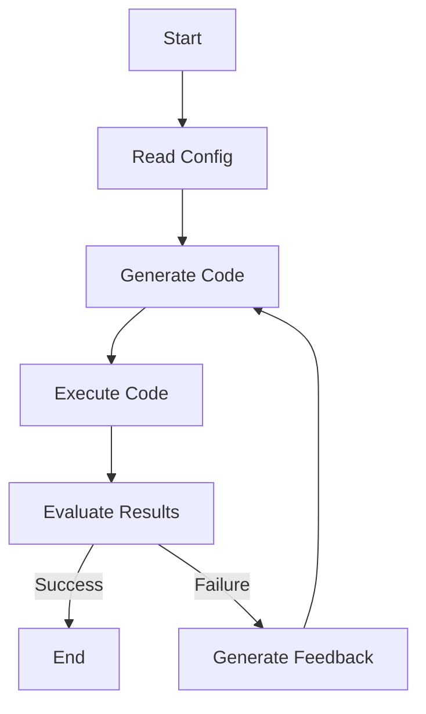

# Agents Creating Agents

A comprehensive look at the creation of single-file agents using Azure OpenAI SDK with a focus on Agent patterns. 

## Overview

This repository contains examples demonstrating various features of the Azure OpenAI SDK, with a focus on building intelligent agents and assistants. Each example is implemented as a self-contained Python script with built-in tests.

## The Director Pattern: LLM as a Judge

The Director pattern implements an LLM-as-Judge approach where a central "Director" LLM evaluates and guides the work of other LLMs. This pattern is particularly effective for tasks requiring iterative improvement and self-evaluation, where one LLM can assess and provide feedback on the outputs of another. In this repository, we demonstrate this pattern specifically through the creation of single-file agents, but the pattern itself is broadly applicable to various LLM evaluation scenarios.

### How It Works

1. **Configuration**: The Director reads a YAML configuration file that specifies:
   - The desired agent behavior and requirements
   - Model configurations for both coding and evaluation
   - Context files (editable and read-only)
   - Execution commands for validation

2. **Iterative Development**: The Director follows a cycle:
   - Generates code based on requirements
   - Executes the code
   - Evaluates the results
   - Provides feedback for improvement
   - Repeats until success or max iterations reached



### Key Components

- **Coder LLM**: Responsible for generating and modifying code
- **Evaluator LLM**: Acts as a judge to evaluate the code's success
- **Configuration**: YAML files defining requirements and settings
- **Context Files**: Both editable and read-only files that provide context
- **Execution Environment**: Where the generated code is tested

### Benefits

- **Self-Improving**: Each iteration builds on previous feedback
- **Structured**: Clear separation between coding and evaluation
- **Flexible**: Works with different LLM providers and models
- **Validated**: Built-in testing and evaluation
- **Configurable**: Easy to modify behavior through YAML configs

## Single-File Agents

This folder demonstrates two types of single-file agents created using the Director pattern:

### Basic Agent
A simple, self-contained agent that performs a single task. This agent demonstrates the fundamental principles of the Director pattern in its most basic form.

- [Director Configuration](specs/director_basic_agent_maker.yaml)
- [Agent Specification](specs/basic_agent_spec.md)

### Multi-Agent
A more complex agent that demonstrates coordination between multiple specialized agents, each handling different aspects of a task while working together.

- [Director Configuration](specs/director_multi_agent_maker.yaml)
- [Agent Specification](specs/multi_agent_spec.md)

## Demonstration

1. Configure Azure OpenAI credentials by setting environment variables:

   The Evaluator (uses Azure OpenAI SDK directly):
   ```bash
   export AZURE_OPENAI_ENDPOINT="https://your-resource.openai.azure.com"
   export AZURE_OPENAI_API_KEY="your_api_key"
   export AZURE_OPENAI_VERSION="2024-12-01-preview"
   ```

   The Coder (uses Aider which expects different variable names):
   ```bash
   export AZURE_API_BASE="https://your-resource.openai.azure.com"  
   export AZURE_API_KEY="your_api_key"
   export AZURE_API_VERSION="2024-12-01-preview"
   ```

   For other providers, set the following environment variables:
   ```bash
   export OPENAI_API_KEY="your_api_key"
   export ANTHROPIC_API_KEY="your_api_key"
   ```

2. Initialize the Project

   ```bash
   uv sync
   ```

2. Use the Director to create an agent.

   ```bash
   uv run python director.py --config specs/director_basic_agent_maker.yaml
   uv run python director.py --config specs/director_multi_agent_maker.yaml
   ```

## Using a Pull Request Description Agent

> __🤔 Dig Deeper__ 
> 
> [AIPR](https://pypi.org/project/pr-generator-agent/) demonstrates how agents can be used to automate and improve development workflows. It intelligently analyzes changes, performs security scans, and leverages state-of-the-art AI models to help teams save time while maintaining high-quality, consistent pull request descriptions.

AIPR (Agentic Pull Request Description Generator) is an example of a specialized agent that automatically analyzes git diffs and generates comprehensive pull request descriptions.

- [GitHub Repository](https://github.com/danielscholl/pr-generator-agent)


### Demonstration

1. Install AIPR

   ```bash
   pip install pr-generator-agent
   ```

2. Analyze the Change Set

   ```bash
   aipr
   ```

