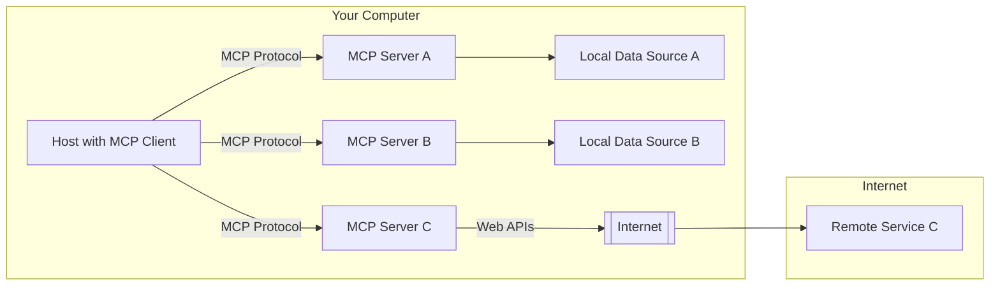

# The Power of Context

Context in AI refers to the background information and relevant details that help frame an AI model's understanding of a request. Think of context like having a conversation with a friend - the more they know about the situation, the more helpful and relevant their advice will be.

```ascii
    +----------------+
    |    Context     | ← Background information
    +--------+-------+
            |
            v
    +----------------+
    |     Prompt     | ← Your specific question
    +--------+-------+
            |
            v
    +----------------+
    |      AI        | ← Processing with awareness
    |     Model      |
    +----------------+
            |
            v
    +----------------+
    |    Response    | ← Informed, relevant answer
    +----------------+
```

## 🪟 The Context Window

**Definition:** The context window is the amount of text (measured in tokens) that an AI model can "see" and consider when generating a response. Think of it as the model's short-term memory - everything within this window influences the response, while anything outside it is essentially invisible to the model.

### Token Limits and Their Impact

| Model | Context Window Size | Real-world Equivalent |
|-------|-------------|------------------------|
| Claude-3 | ~200,000 tokens* | A novel |
| GPT-4 | ~32,000-128,000 tokens* | A small book |
| Gemini | ~32,000 tokens* | A long article |
| Llama-2 | ~4,096 tokens | About 3-5 pages of text |
| Phi-2 | ~2,048 tokens | About 2-3 pages of text |

_* These figures represent approximate or reported capabilities._

**Everyday Analogy:** Think of tokens like words in a conversation. If you can only remember the last 10 words someone said, you'll miss important details from earlier in the discussion. Similarly, AI models with smaller context windows may "forget" information provided earlier.

### Practical Implications

⬇️  **Small Context Window Challenges:**
- Limited memory of previous exchanges in a conversation
- Inability to process long documents or code bases
- Need to frequently repeat information

⬆️ **Large Context Window Benefits:**
- More coherent multi-turn conversations
- Ability to analyze entire documents and provide comprehensive summaries
- Better understanding of complex problems requiring extensive background


## 👑 Context is King 

### What is Model Context Protocol (MCP)?

The Model Context Protocol (MCP) is an open standard developed by Anthropic to enable seamless integration between AI models and external tools/data sources. Similar to how REST Protocol standardized web service communication, MCP standardizes how language models interact with external systems, eliminating the need for custom integration code for each new tool or data source.



### 🔌Why We Need MCP 

Think of AI models like smart students who are isolated in a room with only the books they've already read. They're knowledgeable but limited to what they learned during training. MCP is like giving these students a smartphone with internet access—suddenly they can:

- **Access Real-Time Information**: Instead of working with outdated knowledge, they can check the latest data
- **Use Specialized Tools**: Rather than doing all calculations manually, they can use calculators and spreadsheets
- **Connect with Experts**: Instead of guessing at specialized questions, they can consult with authorities

Without MCP, each connection between an AI and an external tool requires custom code—imagine needing a different type of charger for every device you own. MCP creates a universal connector that works across different systems.

### 💪 Powerful Features 

**1. Dynamic Tool Access**  
The AI can reach out to different tools as needed, like a chef pulling ingredients from various cabinets in a kitchen. It might check your calendar to schedule a meeting, then access weather data to suggest indoor or outdoor venues.

**2. Context Persistence**  
MCP maintains memory across interactions. It's like having a conversation where the other person never forgets what you discussed earlier—even if you talk about multiple topics.

**3. Built-In Security**  
Security is baked into the protocol, not added as an afterthought. 

### 🔍 Real-World Example: Firecrawl 

Firecrawl is an MCP tool that helps AI models gather information from the web. Imagine you're implementing an API Gateway in Azure Kubernetes Service (AKS) using Istio:

- **Without Firecrawl**: The AI might suggest generic code snippets based on outdated training data, missing recent Istio updates or AKS-specific configurations.

- **With Firecrawl**: The AI can:
  1. Pull the latest Istio documentation for AKS
  2. Find specific examples of API Gateway implementations
  3. Retrieve compatibility details between your Istio version and AKS
  4. Gather best practices for security configurations

For example, when you ask about connecting an external gateway to a service in your namespace, Firecrawl can fetch the exact YAML syntax for the latest Kubernetes Gateway API:

```yaml
apiVersion: gateway.networking.k8s.io/v1beta1
kind: ReferenceGrant
metadata:
  name: allow-istio-system
  namespace: sample-app
spec:
  from:
  - group: gateway.networking.k8s.io
    kind: HTTPRoute
    namespace: istio-system
  to:
  - group: ""
    kind: Service
    name: productpage
```

The best part? Firecrawl seamlessly adapts this knowledge to your specific implementation, understanding your AKS cluster version, current configuration files, and project requirements—all without you having to search through multiple documentation sources.

# Practical Demonstration

> __🤔 Dig Deeper__ [MCP Protocol Documentation](https://modelcontextprotocol.io/introduction)

- Hands-on setup of [Github MCP Server](https://github.com/modelcontextprotocol/servers/tree/main/src/github) for Github Copilot

```
CREATE github issue:
    title: Changelog.md
    content: describe that we need a changelog as we have code samples in this repo.
```

`.vscode/mcp.json`
```json
{
    "inputs": [
        {
            "type": "promptString",
            "id": "github-key",
            "description": "Github PAT"
        }
    ],
    "servers": {
        "github": {
            "command": "docker",
            "args": [
                "run",
                "-i",
                "--rm",
                "-e",
                "GITHUB_PERSONAL_ACCESS_TOKEN",
                "mcp/github"
            ],
            "env": {
                "GITHUB_PERSONAL_ACCESS_TOKEN": "${input:github-key}"
            }
        }
    }
}
```
