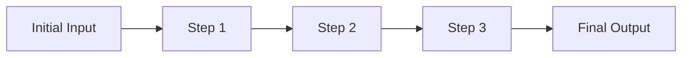
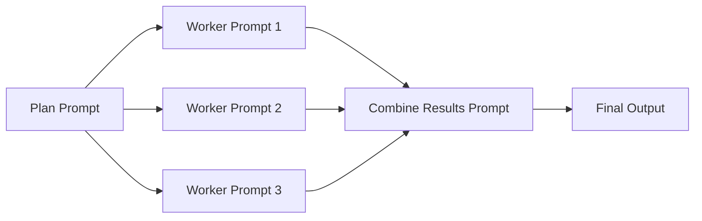
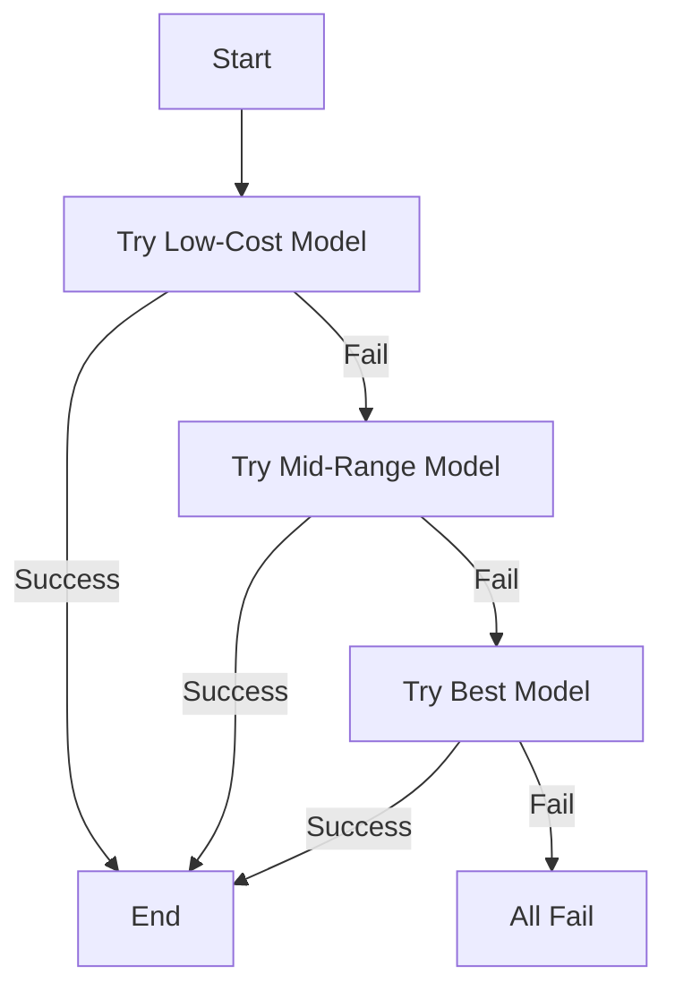
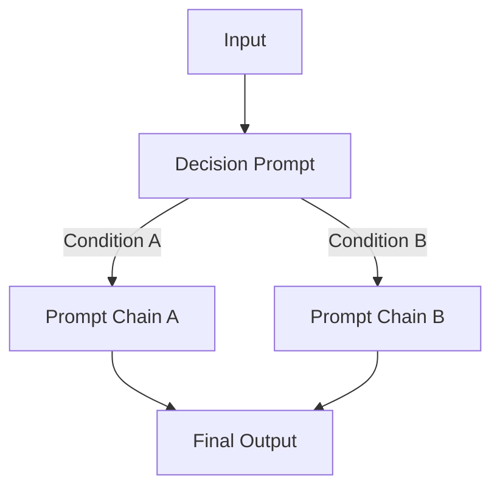
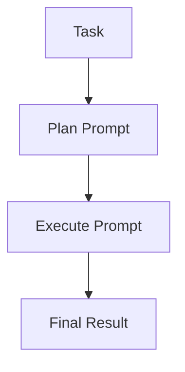
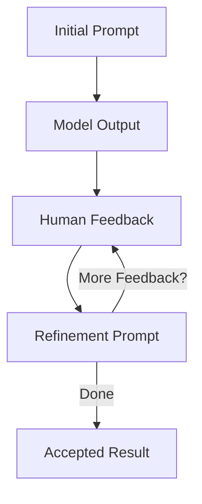
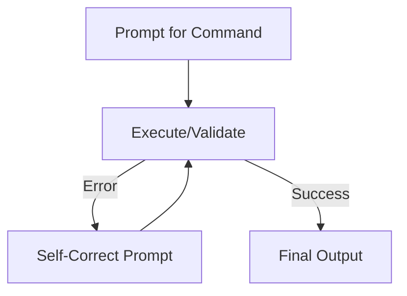

# Mastering Prompt Chaining

Large Language Models (LLMs) are revolutionizing how we approach tasks in research, industry, and education. From generating creative content to assisting with complex coding challenges, LLMs are incredibly powerful tools. However, simply throwing a single prompt at an LLM isn't always the most effective strategy. A more nuanced approach involves chaining multiple prompts together – a technique known as *prompt chaining*. This structured method allows you to incrementally build ideas, incorporate decision-making, establish fallback mechanisms, and continuously refine your results.

By breaking down large, complex tasks into smaller, more manageable steps, each individual prompt can concentrate on a specific aspect of the overall goal. This helps maintain clarity, adaptability, and higher-quality outputs. Think of it like a recipe – you wouldn't bake a cake in a single step!

### Why Prompt Chaining is a Game Changer

Why should you invest time in mastering prompt chaining?

-   __Incremental Complexity:__ Start with the basics and build up complexity gradually across several steps.
-   __Modular Reasoning:__ Isolate different concerns (like planning, executing, and validating) into separate prompts.
-   __Adaptive Workflows:__ Make your process smarter by implementing conditional logic for path selection and backup models for robust results.
-   __Human-Model Collaboration:__ Create feedback loops that integrate human insights or self-correction methods for continuous enhancement.

Combined with unique domain knowledge, the right sequence of prompts can result in products and tools worth five, six, or even seven figures. By strategically leveraging prompt chaining, you can build agentic software that works on your behalf to create exceptional value for both you and your users.

Here are some common prompt chaining patterns, each with:

-   A clear conceptual description
-   A visual diagram to enhance understanding
-   Examples to illustrate the pattern
-   Pseudocode to clarify the logic


## The Snowball Prompt Chain: Building Momentum

> [Sample](snowball.sh)

-   __Concept:__ Start with a simple piece of information and gradually "snowball" it into something richer and more complete.
-   __Analogy:__ Think of starting with a single snowflake and watching it grow into a snowball as it rolls down a hill.
-   __Example:__ Begin with a topic, generate a title, create an outline, develop a full draft, and finally, format it for publication.

> The Snowball approach ensures that each subsequent prompt benefits from and is constrained by the previous output, which helps maintain coherence and a logical flow. This pattern is ideal for generating reusable content like blogs, newsletters, or research reports.



## Workers Prompt Chain: Divide and Conquer

> [Sample](workers.sh)

- __Concept:__ Assign individual "worker" prompts to handle different subtasks. Each worker focuses on a specific piece of the larger problem. A synthesis prompt aggregates the outputs.
- __Analogy:__ Imagine a team of specialists each contributing their expertise to complete a project.
- __Example:__ Begin with a topic, generate a title, create an outline, develop a full draft, and finally, format it for publication.

> The Workers pattern promotes modularity. Each worker focuses on a specific piece, making the overall process more manageable and robust. This is especially powerful for applications like research tools, content creation, and coding assistance.




## Fallback Prompt Chain: Resourceful Model Selection

> [Sample](fallback.sh)

-   __Concept:__ Begin with a simple, cheaper, or faster model and attempt to solve the task. If it fails or provides inadequate results, move to a more advanced and potentially more expensive model.
-   __Analogy:__ Think of a backup system that kicks in when the primary system doesn’t work.

*Note:* The Fallback pattern optimizes cost by using more advanced options only when simpler ones fail. This pattern can be extended to dynamic systems that adjust prompts and outputs based on real-time conditions, enhancing reliability and efficiency.




## Decision Maker Prompt Chain: Adaptive Workflows

> [Sample](decision.sh)

- __Concept:__ Use a dedicated prompt to analyze conditions and intelligently select the most appropriate subsequent chain of prompts. This creates dynamic workflows that adapt based on context, sentiment, complexity, or other factors.

- __Analogy:__ Think of a skilled project manager who evaluates a situation and assigns the right team with the right approach for each unique challenge.

- __Example:__ Analyze customer feedback sentiment to determine whether to trigger a satisfaction enhancement workflow or a complaint resolution workflow.

> The Decision Maker pattern enables intelligent branching in your prompt chains, making them more responsive to specific situations and requirements. This is particularly valuable for customer service, content moderation, and adaptive learning systems.



*Note:* The Decision Maker pattern transforms static prompt chains into intelligent workflows that can adapt to different scenarios. This flexibility is crucial for building robust applications that can handle diverse inputs and requirements effectively.


## Plan-Execute Prompt Chain: Strategic Implementation

> [Sample](plan-execute.sh)

- __Concept:__ Separate the reasoning/planning phase from the execution phase to ensure more thoughtful and structured results. The planning prompt creates a strategic approach, while the execution prompt implements it.
- __Analogy:__ Similar to an architect first creating detailed blueprints before actual construction begins.
- __Example:__ When designing a complex system, first outline the architecture and components, then implement each part according to the plan.

### Key Benefits:

- __Improved Structure:__ Forces a methodical approach to problem-solving
- __Better Error Prevention:__ Catches potential issues during the planning phase
- __Enhanced Clarity:__ Creates clear documentation of the thought process
- __Easier Validation:__ Allows for plan review before committing to execution
- __Reusable Components:__ Plans can be saved and reused for similar tasks

> The Plan-Execute pattern promotes methodical problem-solving by ensuring thorough planning before implementation. This approach reduces errors and improves the overall quality of outputs.



## Human-in-the-Loop Prompt Chain: Collaborative Refinement

> [Sample](human-loop.sh)

- __Concept:__ Integrate human feedback into the prompt chain workflow. The LLM generates initial content, humans provide feedback, and subsequent prompts refine the output based on that feedback.

- __Analogy:__ Like an editor and writer working together, where the writer (LLM) produces content and the editor (human) provides guidance for improvements.

- __Example:__ Iteratively developing a marketing strategy where human experts can validate and refine the AI's suggestions.

> The Human-in-the-Loop pattern combines the efficiency of AI with human expertise and judgment, resulting in higher quality outputs that better align with specific needs and constraints.



## Self-Correct Prompt Chain: Autonomous Error Recovery

> [sample](self-correct.sh)

- __Concept:__ Implement a feedback loop where the model evaluates and corrects its own output. When errors or suboptimal results are detected, the model automatically attempts to improve its response.

- __Analogy:__ Like a self-debugging program that can identify and fix its own issues.

- __Example:__ Generating and validating code, where the model can detect syntax errors and fix them automatically.

> The Self-Correct pattern enhances reliability by enabling autonomous error detection and correction, reducing the need for human intervention in handling common issues.



## Meta Prompt Pattern: Structured Template Systems

- __Concept:__ Use structured XML templates to create reusable prompt systems with clear sections for instructions, patterns, and examples.

- __Analogy:__ Similar to how software design patterns provide templates for solving common programming problems.

- __Usage:__ Ideal for creating specialized analysis tools that can be repeatedly used across different inputs.

```bash
# Example: Using a Meta Prompt for POM file refactoring
llm --system "$(cat metaprompt.xml)" < pom.xml
```

The Meta Prompt pattern typically includes these XML sections:
- `<purpose>`: Defines the specialized role and objectives
- `<instructions>`: Provides detailed steps to follow
- `<pattern>`: Shows examples of desired format/structure
- `<examples>`: Demonstrates correct outputs for reference

This pattern is particularly valuable for creating specialized tools that can be repeatedly applied to different inputs while maintaining consistent behavior and output quality.


## Conclusion

Prompt chaining isn't just a fancy technique; it's a fundamental strategy for getting the best out of LLMs. By understanding and utilizing these patterns, you can tackle complex tasks with more precision, adaptability, and control.
